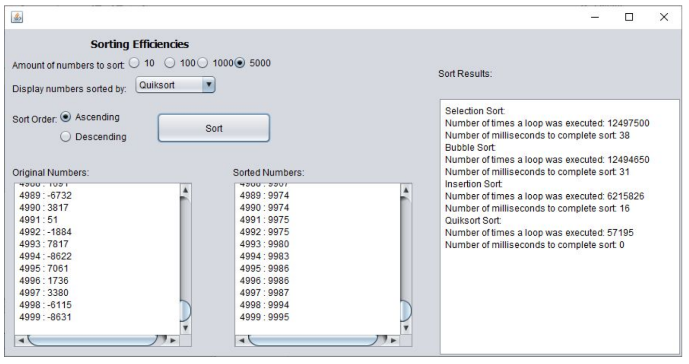

# Compare-Sorting-Algos
A GUI thing that runs a bunch of basic sorts and shows the number of 'moves' made

A user should have the choice of:
- the number of random numbers to display (10, 100, 1000, or 5000) ~ from -10k to +10k
- the order the numbers will be sorted in (ascending, descending)
- which algorithm they would like to see the numbers sorted by
Examples: selection sort, bubble sort, insertion sort, quicksort, or mergesort

The program will display the number of times a loop was executed, as well as the actual time, in milliseconds, that it took to complete each sort.

